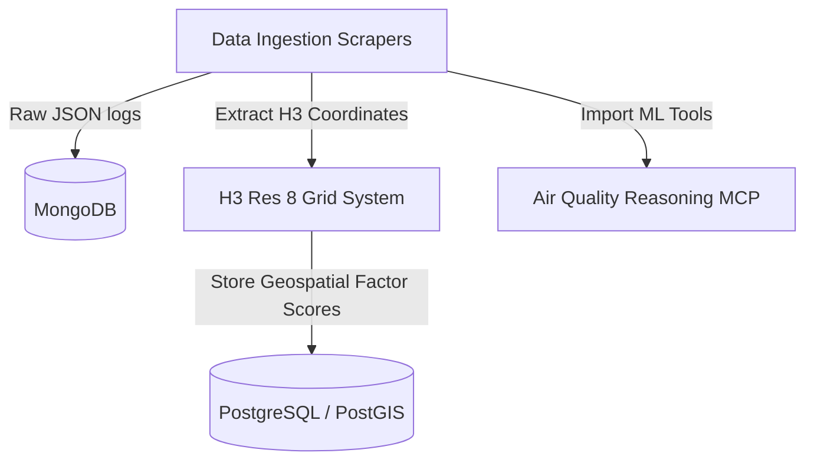

# UrbanLens AI - Technical Implementation Details 🏙️

UrbanLens AI is a modular geospatial analysis system designed to ingest, process, and score liveability metrics at a hyper-local scale (using the H3 grid system). This document outlines what has been implemented, the technology stack chosen, and a detailed road map of next steps for the project.

---

## 🛠️ Tech Stack Overview

The project is structured with a modular Python backend, leveraging advanced spatial indexing, deep learning models, and dual-database orchestration.

### 1. Geospatial & Spatial Indexing
- **Uber H3 (Resolution 8)** (`h3`): Used to divide target cities into regular hexagonal cells of ~0.737 square kilometers. All liveability scoring, POI density, and social signals are referenced to H3 indices.
- **Shapely** (`shapely`): Handles geometric calculations (e.g., transforming H3 boundaries into WKT polygons).
- **GeoPandas** (`geopandas`): Manages spatial dataframes, coordinates, and spatial queries.

### 2. Storage & Database Layer
- **MongoDB** (`pymongo`): Houses raw ingestion logs and semi-structured collections (`raw_amenities`, `air_quality_logs`, `climate_resilience_logs`, `social_signals`, `mapillary_images`). Ensures raw scrapings are preserved even if PostgreSQL connections fail.
- **PostgreSQL with PostGIS** (`psycopg2-binary`): Stores structured urban grids and consolidated factor scores in `urban_grids` and `factor_scores` tables for downstream API consumption.

### 3. Machine Learning & Inference
- **TensorFlow / Keras**: Executes the LSTM model (`models/aqi_lstm_saved_model.keras`) to predict a 4-hour air quality forecast.
- **ONNX Runtime** (`onnxruntime`): Powering highly optimized, lightweight CPU inference for:
  - CNN classification (`aqi_cnn.onnx`) for visual pollution signatures.
  - MLP emissions modeling (`emission_model_final.onnx`) for vehicle exhaust levels.
  - Multi-task risk score modeling (`best_air_quality_model.onnx`) for environmental health indices.
- **PyTorch & Ultralytics** (`torch`, `torchvision`, `ultralytics`): Loads `DeepLabV3` for semantic green canopy segmentation and `YOLOv8` for street object detection (lights, sidewalks).

### 4. Integration & Crawling
- **API Clients & Web Agents** (`requests`): Direct HTTP integration with OSM Overpass API, Open-Elevation, Reddit public endpoints, and Mapillary v4 API, using custom browser headers to bypass request filtering.
- **Model Context Protocol** (`mcp`): Enables hosting models locally through a FastMCP server to serve tools dynamically to LLM-based assistants.

---

## 📝 Completed Implementation Details

We have successfully built the **data ingestion and reasoning layer**, satisfying all test cases.

### 1. The 5 Ingestion Scrapers (`src/scrapers/`)
- **`osm_scraper.py`**: Queries OpenStreetMap via Overpass API to locate public transit, emergency services, and daily essentials. Implements user-agent rotations and transforms geographic points directly to H3 indexes.
- **`aqi_scraper.py`**: Computes air quality liveability indices and triggers LSTM & Health Risk models imported from the local MCP server. Falls back to a strict formulaic model if models are missing.
- **`elevation_scraper.py`**: Accesses the public Open-Elevation API to assess topography and compute environmental climate resilience scores.
- **`mapillary_scraper.py`**: Queries the Mapillary v4 API for street-level photos, downloading thumbnails for CV pipelines or generating synthetic visual placeholders if access tokens are missing.
- **`reddit_scraper.py`**: Parses local subreddits (e.g., `r/chennai`, `r/bangalore`) looking for civic complaints (power cuts, flooding, water logging) to calculate a localized neighborhood sentiment score.
- **`base_scrapers.py`**: Provides basic interfaces for real estate and social media logging into local MongoDB databases.

### 2. Deep Learning MCP Server (`mcp_server/server.py`)
- Standardized under FastMCP to expose 4 tools:
  1. `predict_aqi_forecast`
  2. `classify_pollution_image`
  3. `predict_vehicle_emission`
  4. `estimate_health_risk`
- Configured to automatically locate saved Keras and ONNX models relative to the script location.

### 3. Verification Suite (`tests/`)
- Implemented 11 modular unit tests confirming logic soundness for OSM coordinates, public API mock fail-safes, H3 cell translations, and MongoDB/JSON output pipelines.

---

## 🚀 Detailed Next Steps

To transform these ingestion pipelines into the final Liveability Index platform, follow these next development phases:

### Phase 1: Pipeline Orchestration & DAG Connection
- **Objective**: Integrate scrapers into the main scheduler.
- **Steps**:
  1. Update [weekly_liveability_update.py](file:///p:/Hackathons/UrbanLens%20AI/src/orchestration/airflow_dags/weekly_liveability_update.py) to import the newly developed scrapers.
  2. Orchestrate tasks so that `OSMScraper`, `RedditScraper`, `ElevationScraper`, and `MapillaryScraper` run concurrently for target cities.
  3. Set up Airflow Variables or environment files within Airflow workers to pass database credentials.

### Phase 2: Street Imagery Computer Vision Pipeline
- **Objective**: Analyze downloaded street views.
- **Steps**:
  1. Connect `MapillaryScraper` downloaded thumbnails to [cv_pipeline.py](file:///p:/Hackathons/UrbanLens%20AI/src/pipelines/cv_pipeline.py).
  2. Execute the `calculate_green_canopy_score` using `DeepLabV3` to output foliage percentages.
  3. Run `YOLOv8` to detect sidewalk presence, streetlights, and obstacles. Save results into the PostgreSQL `factor_scores` table as `pedestrian_infrastructure` and `street_illumination`.

### Phase 3: Profile Engine & API Layer
- **Objective**: Deliver personalized scoring.
- **Steps**:
  1. Write the scoring aggregation algorithm in `src/pipelines/profile_engine.py`.
  2. Create profiles (Student, Remote Engineer, Family) with custom factor weights:
     $$\text{Liveability Score} = \sum (\text{Factor Score} \times \text{Profile Weight})$$
  3. Build a FastAPI backend serving these scores dynamically given an H3 index and a user preset.

### Phase 4: Local Infrastructure Dockerization
- **Objective**: Standardize workspace deployment.
- **Steps**:
  1. Create a `docker-compose.yml` defining PostgreSQL with PostGIS, MongoDB, and OSRM (Open Source Routing Machine).
  2. Include seeding scripts to initialize database schemas and import model binaries.
